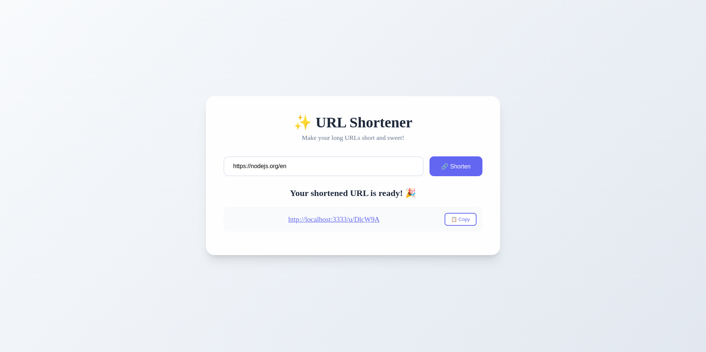

<h1 style="text-align:center;">✨ URL Shortener</h1>

<p style="text-align:center">A modern URL shortening service built with React, TypeScript, and Express.</p>



## 🚀 Getting Started

### Prerequisites

- Node.js (v18 or higher)
- pnpm (recommended) or npm

### Installation

1. Clone the repository:

```bash
git clone https://github.com/shel404/url-shortener-assessment
cd url-shortener-assessment
```

2. Install dependencies:

```bash
# Install frontend dependencies
cd frontend
pnpm install

# Install backend dependencies
cd ../backend
pnpm install
```

### Development

1. Start the backend server:

```bash
cd backend
pnpm dev
```

2. In a new terminal, start the frontend development server:

```bash
cd frontend
pnpm dev
```

The application will be available at:

- Frontend: http://localhost:5173
- Backend API: http://localhost:3000

### Testing

#### Frontend Tests

```bash
cd frontend
pnpm test
```

#### Backend Tests

```bash
cd backend
pnpm test
```

### Building for Production

1. Build the backend:

```bash
cd backend
pnpm build
```

2. Build the frontend:

```bash
cd frontend
pnpm build
```

The frontend build will be available in `frontend/dist` directory.
The backend build will be available in `backend/dist` directory.

## 🌟 Features

- Shorten long URLs to easily shareable links
- Copy shortened URLs to clipboard with one click
- Automatic URL validation
- Comprehensive test coverage
- TypeScript for type safety

## 📝 Environment Variables

### Frontend (.env)

```env
VITE_API_URL=http://localhost:3000
```

### Backend (.env)

```env
PORT=3000
```

## 📁 Project Structure

```
url-shortener/
├── frontend/
│   ├── src/
│   │   ├── components/
│   │   ├── tests/
│   │   └── App.tsx
│   ├── package.json
│   └── vite.config.ts
└── backend/
    ├── src/
    │   ├── routes/
    │   ├── helpers/
    │   ├── __tests__/
    │   └── index.ts
    ├── package.json
    └── tsconfig.json
```

## 🧪 Testing

### Frontend Tests

- Component rendering
- URL shortening functionality
- Clipboard operations
- Error handling
- Browser validation

### Backend Tests

- API endpoints
- URL validation
- Short URL generation
- Error handling

## Explanation

### Data Structure

- Hash Map: Efficient for storing and retrieving mappings. It ensures O(1) time complexity for both operations.

### Short URL Uniqueness

- Collision Avoidance: Generate random 6-character strings and retry if a collision occurs.
- Base62 Encoding: Encodes numbers/bytes to alphanumeric characters, ensuring short and readable strings.

### Error Handling

- Validate URLs using the URL constructor.
- Handle retries for collision avoidance gracefully.
